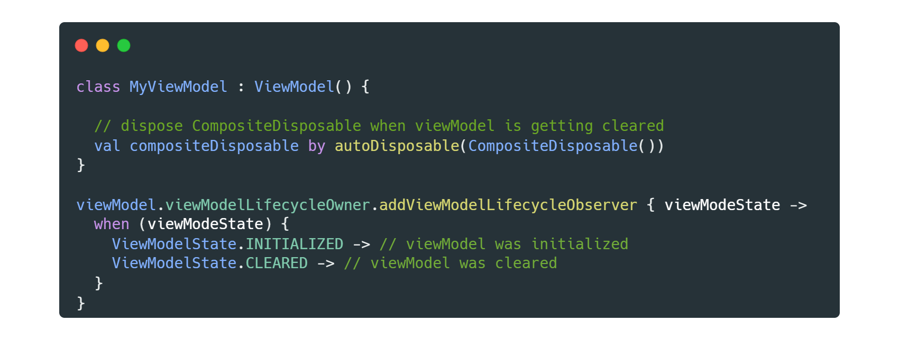

<h1 align="center">ViewModel Lifecycle</h1></br>

<p align="center">
  <a href="https://opensource.org/licenses/Apache-2.0"></a>
  <a href="https://android-arsenal.com/api?level=21"></a>
  <a href="https://github.com/skydoves/ViewModel-Lifecycle/actions/workflows/android.yml"></a>
  <a href="https://github.com/skydoves"></a>
  <a href="https://androidweekly.net/issues/issue-506"></a>
  <a href="https://skydoves.github.io/libraries/viewmodel-lifecycle/html/viewmodel-lifecycle/com.skydoves.viewmodel.lifecycle/index.html"></a>
</p>

<p align="center">
🌳 ViewModel Lifecycle allows you to track and observe Jetpack's ViewModel lifecycle changes.<br>
Also, it supports useful extensions for RxKotlin/RxJava and Coroutines.
</p>

<p align="center">

</p>

## Including in your project

[](https://search.maven.org/search?q=g:%22com.github.skydoves%22%20AND%20a:%22viewmodel-lifecycle%22)

### Gradle 
Add the code below to your **root** `build.gradle` file (not your module build.gradle file):
```gradle
allprojects {
    repositories {
        mavenCentral()
    }
}
```

Next, add the dependency below to your **module**'s `build.gradle` file:

```gradle
dependencies {
    implementation "com.github.skydoves:viewmodel-lifecycle:1.1.0"
}
```
## SNAPSHOT 
[](https://oss.sonatype.org/content/repositories/snapshots/com/github/skydoves/viewmodel-lifecycle/) <br>
Snapshots of the current development version of ViewModel-Lifecycle are available, which track [the latest versions](https://oss.sonatype.org/content/repositories/snapshots/com/github/skydoves/viewmodel-lifecycle/).

```gradle
repositories {
   maven { url 'https://oss.sonatype.org/content/repositories/snapshots/' }
}
```

## Usage

`ViewModel-Lifecycle` allows you to observe two lifecycle changes:  **initialized** and **cleared**.

### ViewModelLifecycleOwner

`ViewModelLifecycleOwner` is a lifecycle owner for Jetpack ViewModel, which extends [LifecycleOwner](https://developer.android.com/reference/androidx/lifecycle/LifecycleOwner). It traces and provides lifecycle states for ViewModels. You can get the `ViewModelLifecycleOwner` from your ViewModel as the following:

```kotlin
class MyActivity : AppCompatActivity() {

  private val viewModel by viewModels<MyViewModel>()

  override fun onCreate(savedInstanceState: Bundle?) {
    super.onCreate(savedInstanceState)
    
    val viewModelLifecycleOwner = viewModel.viewModelLifecycleOwner
...
```

Also, you can get it directly on your ViewModel as the following:

```kotlin
class MyViewModel : ViewModel() {

  val lifecycleOwner = viewModelLifecycleOwner
}
```

#### ViewModelLifecycleOwner for LiveData

You can also use it to observe your [LiveData](https://developer.android.com/topic/libraries/architecture/livedata) with the `ViewModelLifecycleOwner` according to ViewModel's lifecycle. If the lifecycle moves to the cleared state, the observer will automatically be removed.

```kotlin
class MyViewModel : ViewModel() {

  private val liveData = MutableLiveData<String>()

  init {
    val lifecycleOwner = liveData.observe(viewModelLifecycleOwner) {
      // sometihng
    }
  }
}
```

> Note: If you use `ViewModelLifecycleOwner` to observe your LiveData, observers will receive every event before the lifecycle moves to the cleared state. But you'll not receive further events by Activity recreations such as screen rotation. So make sure which `lifecycleOwner` is the best solution.

### ViewModelLifecycle

`ViewModelLifecycle` is an implementation of [Lifecycle](https://developer.android.com/jetpack/androidx/releases/lifecycle), which follows the ViewModel's lifecycle. `ViewModelLifecycle` handles multiple `LifecycleObserver` such as `ViewModelLifecycleObserver` to track ViewModel's lifecycle. `ViewModelLifecycle` belongs to `ViewModelLifecycleOwner`, and you can get it directly from the [ViewModelLifecycleOwner] as the following:

```kotlin
val viewModelLifecycle = viewModelLifecycleOwner.viewModelLifecycle
```

### ViewModelLifecycle Observers

You can observe the lifecycle changes of the `ViewModelLifecycle` with `addViewModelLifecycleObserver` extension as the following:

```kotlin
viewModel.viewModelLifecycleOwner.addViewModelLifecycleObserver { viewModelState ->
  when (viewModelState) {
    ViewModelState.INITIALIZED -> // viewModel was initialized
    ViewModelState.CLEARED -> // viewModel was cleraed
  }
}
```

You can also observe the lifecycle changes of the `ViewModelLifecycle` with `addObserver` as the following:

```kotlin
viewModelLifecycleOwner.lifecycle.addObserver(
  object : DefaultViewModelLifecycleObserver {
    override fun onInitialized(viewModelLifecycleOwner: ViewModelLifecycleOwner) {
        // viewModel was initialized
    }

    override fun onCleared(viewModelLifecycleOwner: ViewModelLifecycleOwner) {
        // viewModel was cleraed
    }
  }
)
```

You can also implement your own custom lifecycle observer classes with `DefaultViewModelLifecycleObserver` and `FullViewModelLifecycleObserver` interfaces.


  

## ViewModel Lifecycle for RxKotlin (RxJava)

[](https://search.maven.org/search?q=g:%22com.github.skydoves%22%20AND%20a:%22viewmodel-lifecycle%22)

ViewModel Lifecycle provides useful extensions for RxKotlin (RxJava).

### Gradle

Add the dependency below to your **module's** `build.gradle` file:

```gradle
dependencies {
    // RxKotlin3 (RxJava3)
    implementation "com.github.skydoves:viewmodel-lifecycle-rxkotlin3:$version"

    // RxKotlin2 (RxJava2)
    implementation "com.github.skydoves:viewmodel-lifecycle-rxkotlin2:$version"
}
```

### AutoDisposable

With `autoDisposable` extension, you can create a `Disposable` delegate property which will call the `dispose()` function automatically when ViewModel will be cleared as the following:

```kotlin
class MyViewModel : ViewModel() {

  // dispose CompositeDisposable automatically when viewModel is getting cleared
  val compositeDisposable by autoDisposable(CompositeDisposable())
}
```

The `autoDisposable` extension creates a read-only property, which receives the `Disposable` interface as an inital value.

  

## ViewModel Lifecycle for Coroutines

[](https://search.maven.org/search?q=g:%22com.github.skydoves%22%20AND%20a:%22viewmodel-lifecycle%22)

`ViewModel-Lifecycle` also supports Coroutines to track and observe ViewModel's lifecycle changes.

### Gradle

Add the dependency below to your **module's** `build.gradle` file:

```gradle
dependencies {
    implementation "com.github.skydoves:viewmodel-lifecycle-coroutines:$version"
    implementation "org.jetbrains.kotlinx:kotlinx-coroutines-core:1.5.2"
}
```

### ViewModelLifecycle Flow

You can observe lifecycle changes as a Flow with `viewModelLifecycleFlow` extension as the following:

```kotlin
class MyInteractor(
  private val viewModelLifecycleOwner: ViewModelLifecycleOwner
) : CoroutineScope {

  override val coroutineContext: CoroutineContext = SupervisorJob() + Dispatchers.Main

  init {
    launch(coroutineContext) {
      viewModelLifecycleOwner.viewModelLifecycleFlow().collect { viewModelState ->
        when (viewModelState) {
          ViewModelState.INITIALIZED -> // ViewModel was initialized.
          ViewModelState.CLEARED -> {
            // ViewModel was cleared.
            coroutineContext.cancel() // cancel the custom scope.
          }
        }
      }
    }
  }
}
```

Make sure you cancel your custom `CoroutineScope` after observing the `ViewModelState.CLEARED`, and the `viewModelLifecycleFlow` extension must be launched on **main** thread.

## Find this library useful? :heart:
Support it by joining __[stargazers](https://github.com/skydoves/Lazybones/stargazers)__ for this repository. :star:<br>
And __[follow](https://github.com/skydoves)__ me for my next creations! 🤩

# License
```xml
Copyright 2022 skydoves (Jaewoong Eum)

Licensed under the Apache License, Version 2.0 (the "License");
you may not use this file except in compliance with the License.
You may obtain a copy of the License at

   http://www.apache.org/licenses/LICENSE-2.0

Unless required by applicable law or agreed to in writing, software
distributed under the License is distributed on an "AS IS" BASIS,
WITHOUT WARRANTIES OR CONDITIONS OF ANY KIND, either express or implied.
See the License for the specific language governing permissions and
limitations under the L
